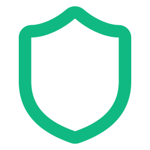

# ClamShield

ClamShield is a modern, Electron-based graphical user interface (GUI) for the ClamAV® antivirus engine. It simplifies the installation, updating, and scanning processes of ClamAV for desktop users while offering a clean, user-friendly Dashboard.

 <!-- Note: Replace with actual screenshot later -->

## Features

- **Automated Engine Management**: Automatically downloads and installs the ClamAV engine (for Windows out-of-the-box, or utilizes existing on Linux/macOS).
- **One-Click Updates**: Updates the ClamAV virus signatures (Freshclam) directly from the GUI.
- **Multiple Scan Types**: Supports Full Scan, Folder Scan, File Scan, and Memory Scan.
- **Real-time Terminal Output**: Watch the ClamAV scan progress in real-time.
- **Quarantine Management**: View and safely manage quarantined threats.
- **Support Us**: Directly support development and third-party databases.

## Technology Stack

- React 18 + Vite
- Tailwind CSS
- Electron
- ClamAV CLI (`clamscan`, `freshclam`)

---

## How to Build & Release (GitHub)

If you want to create a release of ClamShield on GitHub for others to download, follow these step-by-step instructions:

### Prerequisites

Make sure you have Node.js and NPM installed on your machine.

### Step 1: Clone the repository

```bash
git clone https://github.com/your-username/clamshield.git
cd clamshield
```

### Step 2: Install Dependencies

```bash
npm install
```

### Step 3: Build the interface

Compile the React frontend so it's ready for Electron.

```bash
npm run build
```

*Note: In `package.json`, you also have `# build:server` (or `tsx server.ts`) which runs the backend operations.*

### Step 4: Package the Application

To package the application into a `.exe` (on Windows) or an AppImage/deb (on Linux), you can use `electron-builder`. Since `electron-builder` might not be already installed:

```bash
npm install --save-dev electron-builder
```

Update your `package.json` to include an `electron-builder` configuration if you haven't. Example snippet to add:

```json
"build": {
  "appId": "com.clamshield.app",
  "productName": "ClamShield",
  "directories": {
    "output": "release"
  },
  "win": {
    "target": "nsis",
    "icon": "public/icon.png"
  },
  "linux": {
    "target": ["AppImage", "deb"],
    "icon": "public/icon.png"
  }
},
"scripts": {
  ...
  "dist": "npm run build && npx electron-builder"
}
```

Then run the packaging command:

```bash
npm run dist
```

### Step 5: Create a GitHub Release

1. Go to your GitHub repository in your web browser.
2. On the right side of the main page, click on **Releases**, then click **Draft a new release**.
3. Choose a tag or create a new one (e.g., `v1.0.1`).
4. Give your release a title (e.g., `ClamShield v1.0.1`).
5. Write a description of what is new in this release.
6. Drag and drop the installer files (e.g., `ClamShield Setup 1.0.1.exe`) generated in the `release/` folder from Step 4 into the **"Attach binaries by dropping them here"** section.
7. Click **Publish release**.

## License

This software is released under the **GNU General Public License v2 (GPL-2.0)**.
ClamAV is a registered trademark of Cisco Systems, Inc.

## Support

If you like ClamShield, consider supporting its development via the in-app "Settings -> Support Us" page!
